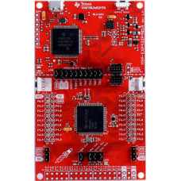
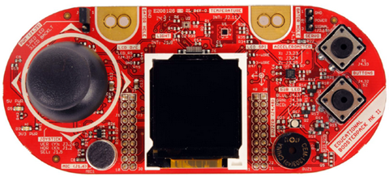
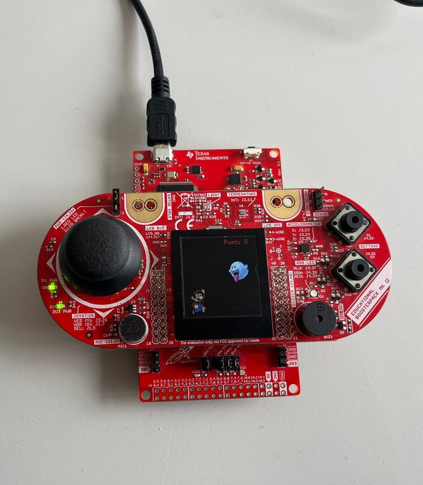

# EmbeddedBros

EmbeddedBros is a game model, that is inspired by “Chrome Dino” and “Super Mario Bros” videogames.  

The main purpose of the developed game is to offer to the final users an interactive and relaxing way to play a simple videogame, by using the Texas Instruments (MSP432P401R Platform and BoosterPack). 

## Requirements
### Software Requirements

To use this project, you will need the following software:

- [MSP432WARE](https://www.ti.com/tool/MSP432WARE) — MSP432Ware for MSP432™ Microcontrollers
- [Code Composer Studio](https://www.ti.com/tool/download/CCSTUDIO) Integrated Development Environment (IDE)
- Software development kit for MSP432: [SIMPLELINK-MSP432-SDK](https://www.ti.com/tool/download/SIMPLELINK-MSP432-SDK/3.40.01.02)

### Hardware Requirements

To use this project, you will need the following hardware:

- Texas Instruments MSP432P401R microcontroller (MCU)
- [Educational BoosterPack MKII](https://www.ti.com/tool/BOOSTXL-EDUMKII)

  
  

  

## Project Layout 
    EmbeddedBros 
    ├── Debug                # Compiled files  
    ├── ADC                  # Initialize ADC hardware 
    ├── Buzzer               # Sends signals using PWM on PIN 2.7 
    ├── Display              # Manages the LCD setup
    ├── Images               # Images structs used on LCD 
    ├── LED                  # Initialize LEDs 
    ├── Timer                # Initialize Timers and Structs used
    ├── targetConfigs        # Target configuration files  
    ├── main.c               # Main source code 
    └── README.md 
 

## Setting up the hardware
Connect the components in the following order:
- Connect the BoosterPack MKII to the MSP432P401R Launchpad;
- Connect the MSP432P401R Launchpad (target system) to the host system.
## Functionalities explanation

The microcontroller shows at startup the first (Mario) of the four available characters.
If the user wants to choose another character, the Joystick comes in help!
In particular, there are two possible directions:
- Turn right
- Turn left

  

 

In this way, it is possible to select another character other than the firstly selected one.

Once the desired character is chosen, the user has to press the Joystick.

Now, three hardware components are activated:
- Countdown Timer
- Buzzer
- LEDs

When the Joystick is pressed, the LCD screen will show the images containing the numbers which compone the countdown (3, 2, 1).
Other than it, the buzzer will produce a periodic sound, for three times (corresponding to the three moments of the countdown), and LEDs are toggled in the following order:
- Red
- Green
- Blue

Once the three moments are concluded, a final image, containing a "Go" string is shown, together with a longer and higher-pitched buzzer sound and the toggle of two LEDs, instead of one.

At this point, the game starts!

Initially, on the screen there is the previously chosen character, positioned on the bottom-left of the screen, and, after a while, a "bad character" will be generated randomly.
The two "badChar" can be:
- Boo
- Goomba

The main purpose of the user is to avoid to overlap with one of the bad characters.

Depending on the bad character generated, there are two ways to avoid them:
- When Boo is generated, it can fly up and down randomly. The point here is that the user can't know when Boo will reach him, so that's why it can become smaller. In this way, Boo will never reach the mini character.

- When Goomba is generated, it only moves on a horizontal direction. In this case, the user has to jump, in order to avoid it. 

Each bad character avoided, makes you earn a point!
Every 5 points reached, a blue LED is toggled.

If you want the match to be more thrilling, you can tilt the board to the right, such that the match becomes faster.

Once you hit the bad character, the game is over!

If you get a greater score than the previous best one, a sequence of LEDs are toggled.

After few seconds, you can re-choose your character, to beat your best score!

 
## Build the project

- Open the project in Code Composer Studio
- Go to: Project → Properties → Build → Arm Compiler → Include Options and add the source directory located in simplelink_msp432p4_sdk_3_40_01_02/

- Go to: Project → Properties → Build → Arm Linker → File Search Path and add: 

        1. msp432p4xx_dreivelib.lib directory_ located in .../source/ti/devices/msp432p4xx/driverlib/ccs/

        2. grlib.a located in .../source/ti/grlib/lib/ccs/m4f/ 
- Build and run the project. The Launchpad should now be displaying the graphics.

## Video and Presentation

[VIDEO](https://youtu.be/hIQrYghvn6U)  --> [Youtube video containing the project simulation]

[PRESENTATION](https://onedrive.live.com/edit.aspx?resid=71C1E9E7ACF08D9B!7438&ithint=file%2cpptx&authkey=!ArRmXMRZEtYa2KE) --> [Presentation of the project]

# Team Members

The project was made step by step together and by sharing 
our own opinion, so there was no clear separation on the work.

COMPONENTS:
- VOINEA ANDREI MARICEL
- HAMZAOUI HAFSA
